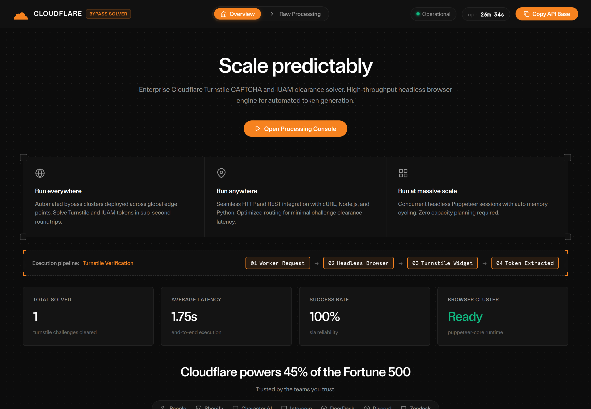
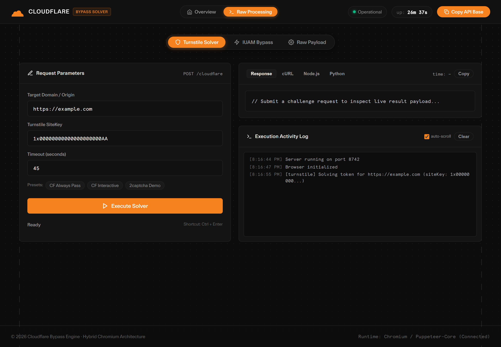

# 🛡️ cf-bypass: High-Performance Cloudflare & Turnstile Solver

A lightning-fast, stealthy API and Web Dashboard for bypassing Cloudflare bot protections—including **Turnstile** (Managed/Interactive Captchas) and **IUAM** (I'm Under Attack Mode / "Checking your browser" clearance). Built on **Bun**, **Rebrowser-Puppeteer**, and **Express**.

<p align="center">
  
</p>

---

## 🌟 Key Highlights

- **Stealth Browser Stack:** Powered by `rebrowser-puppeteer-core` with low-level CDP patch evasions, preventing detection of automation flags.
- **Human Emulation:** Uses `ghost-cursor` with realistic bezier curves and random jitter to pass interactive Turnstile checks.
- **Localized Script Interception:** Serves patched Turnstile client runtimes locally to prevent telemetry fingerprinting and accelerate challenge solving.
- **In-Memory TTL Caching:** Repeated IUAM challenge requests for identical domains resolve instantly (~20ms) from cache without browser spawn overhead.
- **Cloudflare-Themed WebUI:** Dual-page dashboard featuring live performance telemetry, interactive test runner, real-time log streaming, and response inspector.
- **Drop-In Compatibility:** Supports native `/cloudflare` endpoint as well as Violetics-compatible `/solve` and `/solve-challenge` routes.

---

## 📊 Comparison

| Feature | `cf-bypass` | FlareSolverr / Selenium | Advantage |
| :--- | :--- | :--- | :--- |
| **Engine Runtime** | **Bun (Zig-based)** | Node.js / Python | Up to 3x faster startup and minimal idle memory footprint |
| **Browser Driver** | **Rebrowser-Puppeteer** | Standard Puppeteer / Selenium | Patched CDP flags bypass Cloudflare runtime checks |
| **Cursor Physics** | **Ghost Cursor (Bezier)** | Instant / Synthetic Clicks | Natural human movement curves satisfy behavioral heuristics |
| **Resource Policy** | **Aggressive Request Filter** | Loads heavy media & ads | Cuts out tracking scripts and media to save bandwidth and time |
| **Display Mode** | **Xvfb / Headless Native** | Heavy GUI displays | Minimal headless overhead suitable for Docker & low-end VPS |
| **Caching Layer** | **Configurable In-Memory TTL** | No built-in cache | Immediate response for repeated targets |

---

## 🚀 Quick Start

### Option 1: Run with Bun (Local)

**Prerequisites:** [Bun](https://bun.sh/) and Google Chrome installed.

```bash
# Clone the repository
git clone https://github.com/saahiyo/cf-bypass.git
cd cf-bypass

# Install dependencies
bun install

# Start the server (default port: 8742)
bun start
```

Open [http://localhost:8742](http://localhost:8742) in your browser to view the interactive dashboard.

---

### Option 2: Run with Docker

```bash
# Build the Docker image
docker build -t cf-bypass .

# Run the container
docker run -d -p 8742:8742 --name cf-bypass cf-bypass
```

---

## 🖥️ WebUI Dashboard

The service exposes a built-in Cloudflare-inspired dashboard at `/`:

- **Overview Page:** Real-time health telemetry, average and P95 latency monitors, success rate graphs, and visual architecture breakdown.
- **Raw Processing Page:** Live testing playground for Turnstile and IUAM modes with preset test targets, custom parameters, JSON syntax-highlighted responses, token copy, and live streaming runtime logs.

<p align="center">
  
</p>

---

## 🛠️ API Reference

### 1. Unified Endpoint: `POST /cloudflare`

#### Mode: `turnstile`
Solves Cloudflare Turnstile captchas and returns the validation token.

**Request:**
```bash
curl -X POST http://localhost:8742/cloudflare \
  -H "Content-Type: application/json" \
  -d '{
    "mode": "turnstile",
    "domain": "https://2captcha.com/demo/cloudflare-turnstile",
    "siteKey": "1x00000000000000000000AA"
  }'
```

**Response (`200 OK`):**
```json
{
  "success": true,
  "token": "0.4h8F...sample_turnstile_token...",
  "message": "Turnstile challenge successfully solved",
  "elapsed": "2.41s"
}
```

---

#### Mode: `iuam`
Bypasses Cloudflare Under Attack Mode / JavaScript challenge screens and retrieves clearance cookies along with user-agent headers.

**Request:**
```bash
curl -X POST http://localhost:8742/cloudflare \
  -H "Content-Type: application/json" \
  -d '{
    "mode": "iuam",
    "domain": "https://target-domain.com",
    "ttl": 60000
  }'
```

**Response (`200 OK`):**
```json
{
  "success": true,
  "code": 200,
  "cf_clearance": "v01...clearance_token...",
  "user_agent": "Mozilla/5.0 (Windows NT 10.0; Win64; x64) ...",
  "cookies": [
    {
      "name": "cf_clearance",
      "value": "v01...",
      "domain": ".target-domain.com",
      "path": "/"
    }
  ],
  "title": "Target Website Title",
  "final_url": "https://target-domain.com/",
  "elapsed": "3.12s",
  "cached": false
}
```

---

### 2. Violetics-Compatible Routes

For drop-in compatibility with existing integrations:

#### `POST /solve` (Turnstile)
```json
{
  "sitekey": "1x00000000000000000000AA",
  "siteurl": "https://2captcha.com/demo/cloudflare-turnstile",
  "timeout": 45
}
```

#### `POST /solve-challenge` (IUAM)
```json
{
  "siteurl": "https://target-domain.com",
  "timeout": 60
}
```

---

### 3. Monitoring & Telemetry Endpoints

- **`GET /stats`**: Returns real-time metrics including service uptime, in-flight jobs, success rate, average and P95 latency in ms, and recent request events.
- **`GET /api/logs`**: Returns buffered operational runtime logs for remote monitoring and diagnostics.
- **`DELETE /api/logs`**: Clears the in-memory log buffer.

---

## 💻 Code Examples

### Python (`requests`)

```python
import requests

url = "http://localhost:8742/cloudflare"

payload = {
    "mode": "turnstile",
    "domain": "https://2captcha.com/demo/cloudflare-turnstile",
    "siteKey": "1x00000000000000000000AA"
}

res = requests.post(url, json=payload)
data = res.json()

if data.get("success"):
    print("Token:", data["token"])
    print("Elapsed:", data["elapsed"])
else:
    print("Error:", data.get("message"))
```

### TypeScript / JavaScript (`fetch`)

```typescript
const response = await fetch("http://localhost:8742/cloudflare", {
  method: "POST",
  headers: { "Content-Type": "application/json" },
  body: JSON.stringify({
    mode: "iuam",
    domain: "https://target-website.com"
  })
});

const data = await response.json();
console.log("Clearance Cookie:", data.cf_clearance);
console.log("User-Agent:", data.user_agent);
```

---

## ⚙️ Environment Variables

| Variable | Default | Description |
| :--- | :--- | :--- |
| `PORT` | `8742` | HTTP port the server listens on |
| `AUTH_TOKEN` | *(None)* | Optional Bearer authorization token to restrict API access |
| `CACHE_TTL` | `1800000` | In-memory cache duration for IUAM clearance (30 minutes) |
| `BROWSER_LIMIT` | `5` | Maximum concurrent browser contexts allowed |

---

## 📜 License

This project is licensed under the [MIT License](LICENSE).
